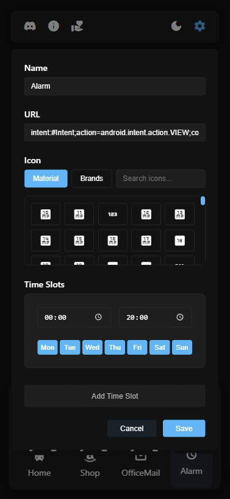

# Znapp - A Dynamic App Launcher

[](https://znapp.netlify.app)
[](https://znapp.netlify.app)

> **Quick Start**: Visit [znapp.netlify.app](https://znapp.netlify.app) and install as a PWA for the best experience!

Znapp is a sleek, customizable application launcher that provides a clean and efficient way to organize and access your applications and links. Built with modern web technologies, it offers a responsive and intuitive interface for managing your shortcuts.

<div style="display: flex; align-items: center;">
  
  
</div>

## Features

### Core Functionality
- **Dynamic App Grid**: Easily add and organize your application shortcuts
- **Drag & Drop**: Intuitively arrange your apps in any order
- **Search**: Quickly find apps using the built-in search functionality
- **Time-Based Visibility**: Apps can be configured to show/hide based on time of day
- **Responsive Design**: Works seamlessly across different screen sizes

### Customization
- **Dark/Light Theme**: Toggle between dark and light modes for comfortable viewing
- **Edit Mode**: Simple interface to add, remove, or modify app shortcuts
- **Custom Icons**: Support for Material Icons and custom icon selection
- **App Controls**: Easy access to edit and remove functions in settings mode

### User Experience
- **Settings Toggle**: Quick access to edit mode for app management
- **Info Panel**: Helpful information for first-time users
- **State Persistence**: Remembers your preferences and app arrangements
- **Clean Interface**: Minimalist design focused on functionality

## Technical Details

### Structure
```
znapp/
├── index.html      # Main application structure
├── app.js          # Core application logic
├── styles.css      # Application styling
├── icons.js        # Icon management module
└── README.md       # Project documentation
```

### Technologies
- Pure JavaScript (No frameworks)
- CSS3 with CSS Variables for theming
- HTML5 Drag and Drop API
- Local Storage for state persistence
- Material Icons for visual elements

### Key Components
- **App Grid**: Main container for application shortcuts
- **Control Bar**: Top navigation with theme and settings toggles
- **Search Function**: Real-time app filtering
- **Settings Mode**: Interface for app management
- **Theme System**: Dynamic theme switching with system preference support

## Getting Started

### Option 1: Use the PWA (Recommended)
1. Visit [znapp.netlify.app](https://znapp.netlify.app)
2. Install as a PWA when prompted (or use browser menu)
3. Launch Znapp from your desktop/home screen
4. Click the settings icon (gear) to enter edit mode
5. Add your first app using the '+' button

### Option 2: Run Locally
1. Clone the repository
2. Open `index.html` in your browser
3. Click the settings icon (gear) to enter edit mode
4. Add your first app using the '+' button
5. Customize your app zone!

## Usage Tips

### Adding Apps
1. Enable settings mode (gear icon)
2. Click the '+' button
3. Enter app details:
   - Name
   - URL
   - Icon (Material Icons supported)
   - Time visibility (optional)

### Managing Apps
- **Move**: Drag and drop in settings mode
- **Edit**: Click the edit icon on any app in settings mode
- **Remove**: Click the remove icon on any app in settings mode

### Time-Based Visibility
Apps can be configured to show only during specific times:
- Set start and end times for visibility
- Apps automatically show/hide based on current time
- Perfect for organizing work/leisure apps

## Support the Project

If you find Znapp useful, consider supporting its development:

[](https://www.paypal.com/donate/?hosted_button_id=SYL79B2QV7CD8)

Your support helps maintain and improve Znapp!

## Community

Join our Discord community for updates, support, and discussions:
[Join Znapp Discord](https://discord.com/channels/1320700666292863018/1320700666292863021)

## Development

### Built with Windsurf AI

Znapp was entirely developed using [Windsurf](https://www.codeium.com/windsurf), a revolutionary AI-powered IDE. This project showcases how modern AI tools can assist in creating clean, efficient, and well-structured web applications:

- **AI-Assisted Development**: Every line of code was written with the help of Windsurf's AI capabilities
- **Clean Architecture**: AI helped ensure consistent code organization and best practices
- **Rapid Development**: Features were implemented efficiently while maintaining high code quality
- **Modern Best Practices**: AI suggestions helped incorporate current web development standards

This project demonstrates the potential of AI-assisted development in creating production-ready applications.

## License

This project is licensed under the MIT License - see the LICENSE file for details.
